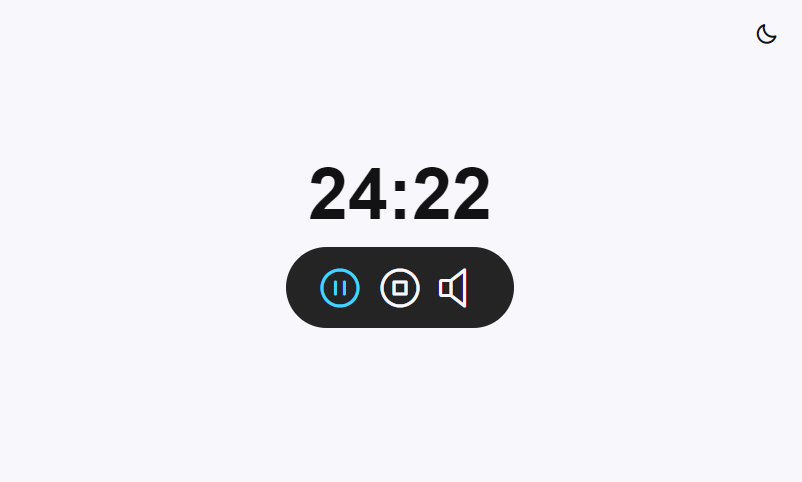

<h1 align="center"> Focus Timer App </h1>

Focus timer, tool that helps you manage time through periods of concentration followed by rest intervals. The goal is to improve productivity, efficiency, and increase concentration.

  <a href="#Technologies">Technologies</a>&nbsp;&nbsp;&nbsp;|&nbsp;&nbsp;&nbsp;
  <a href="#Project">Project</a>&nbsp;&nbsp;&nbsp;|&nbsp;&nbsp;&nbsp;
  <a href="#Link-to-view">Link to view</a>&nbsp;&nbsp;&nbsp;|&nbsp;&nbsp;&nbsp;
  <a href="#memo-license">License</a>

  

  
<h1 align="center">
  
</h1>

<h1 align="center">
  
</h1>

  
<h2 align="left" id="Technologies"> &nbsp;&nbsp; Technologies </h2>

This project was developed with the following technologies:
- [HTML]
- [CSS]
- [JavaScript]
- [Git and Github]

  
<h2 align="left" id="Project"> &nbsp;&nbsp; Project </h2>

  - Focus timer app, pomodoro method  
  - You can set the time, up to 60 minutes, start and pause at any time  
  - When the time is up, a siren sounds to indicate the end  
  - You can activate and deactivate a song that plays in a loop, helping with concentration  
  - It has light mode and dark mode that can be switched by clicking on the icon in the top right corner of the screen  
  - Responsive design, capable of adapting to different screen sizes, better user experience  
  - Project developed during the Full-stack Training course via the platform [Rocketseat](https://app.rocketseat.com.br)  

  
<h2 align="left" id="Link-to-view"> &nbsp;&nbsp;   Link to view </h2>

[Focus Timer](https://lucasfernandesm.github.io/Focus-Timer-App/)

  
## :memo: License

This project is under the MIT license.

---
